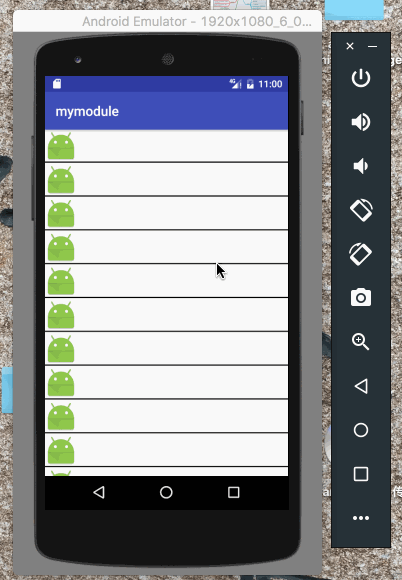
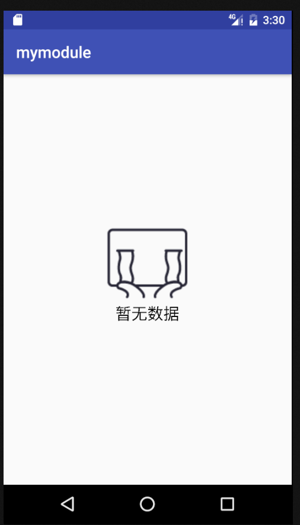

[](https://jitpack.io/#ccx19920806/CCXRecyclerView)
##CCXRecyclerView
####一个具有滑动删除，加载更多和分隔线的recyclerview


如何使用

```java
    allprojects {
        repositories {
            ...
            maven { url "https://jitpack.io" }
        }
    }
```

```java
	dependencies {
	        compile 'com.github.chanchangxing:CCXRecyclerView:1.3.2'
	}
```

```java
//设置是否有删除功能
ccxRecycleView.setDeleteEnable(true);
//设置是否有加载更多功能
ccxRecycleView.setLoadMoreEnable(true);
//设置是否有分割线
ccxRecycleView.setDivideEnable(true);
//设置是否展示空页面
ccxRecycleView.setEmptyViewEnable(true);
//因为加载更多的局限性，请务必设置通过这种方法设置布局
ccxRecycleView.setLayoutManager(CCXRecycleView.LINEARLAYOUT_MANAGER)
ccxRecycleView.setLayoutManager(CCXRecycleView.GRIDLAYOUT_MANAGER)
ccxRecycleView.setLayoutManager(CCXRecycleView.GRIDLAYOUT_MANAGER, 2)

//删除监听事件
ccxRecycleView.addDeleteListener(new CCXRecycleView.OnDeleteListener() {
            @Override
            public void delete(int position) {
                list.remove(position);
                adapter.notifyItemRemoved(position);
            }
        });
//加载更多监听事件
ccxRecycleView.addLoadMoreListener(new CCXRecycleView.OnLoadMoreListener() {
            @Override
            public void loadMore() {
                adapter.notifyDataSetChanged();
            }
        });
```

```xml
<cn.ccx.recycleview.CCXRecycleView
        android:id="@+id/recycler"
        android:layout_width="match_parent"
        android:layout_height="match_parent"
        app:divider_width="1dp"
        app:divider_color="@color/colorAccent"
        app:text="My Life For Android"
        app:text_size="16sp"
        app:text_color="@color/colorPrimary"/>
```

下拉刷新我建议使用SwipeRefreshLayout

如果谁能有一点对于删除情况下分割线动画的想法，可以告知，实在是想不到有什么比较好的方法


